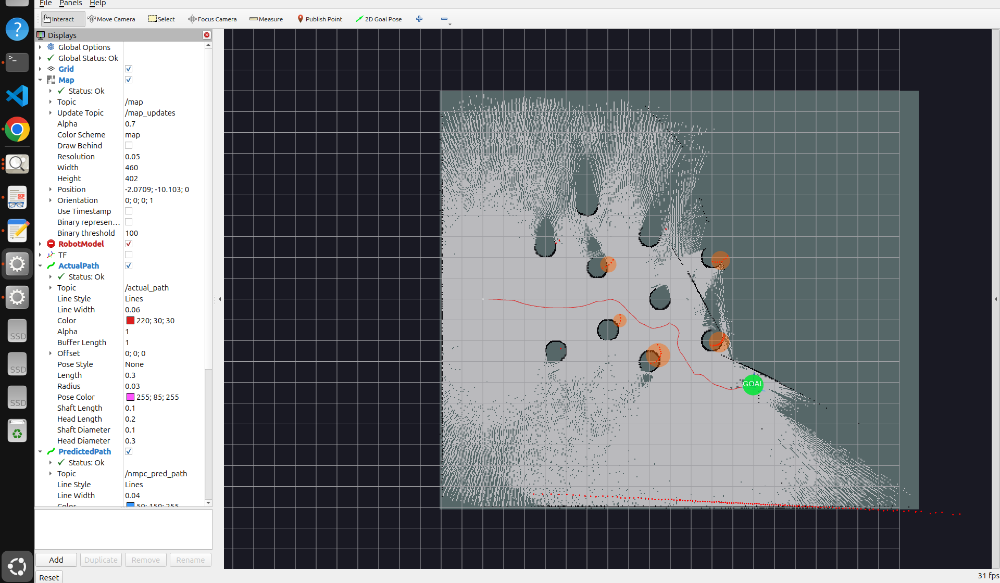
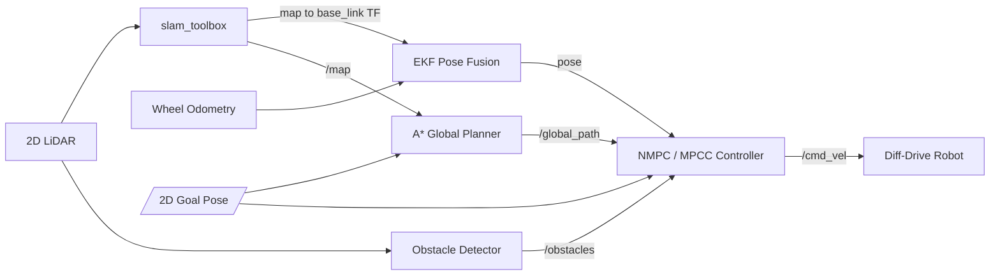
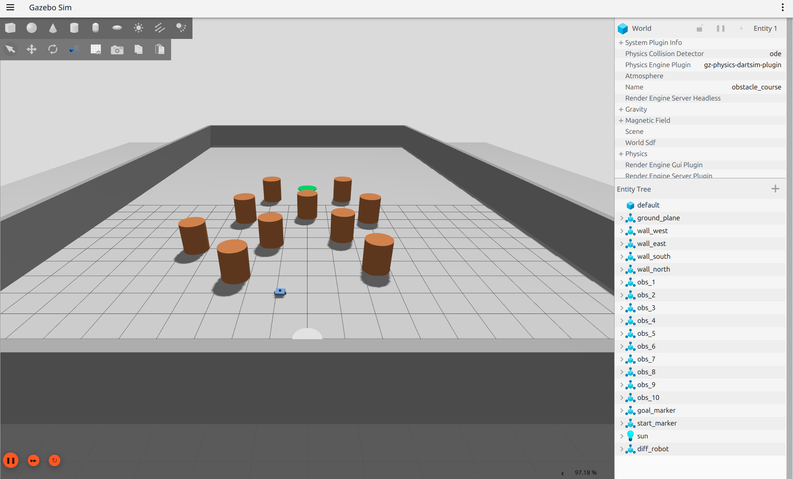
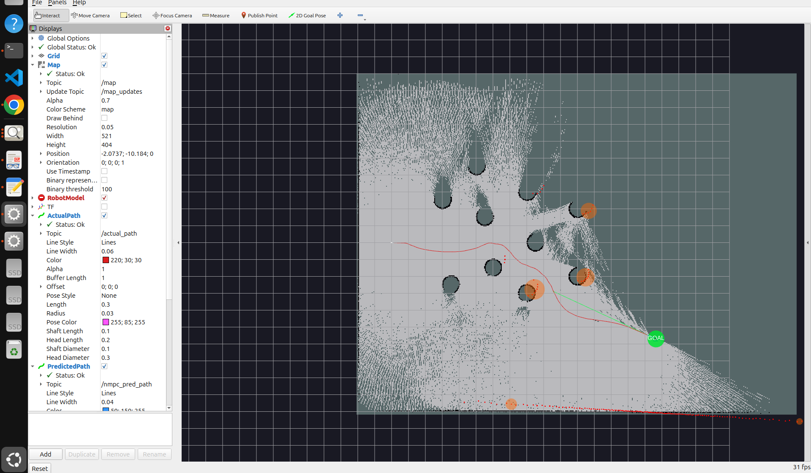
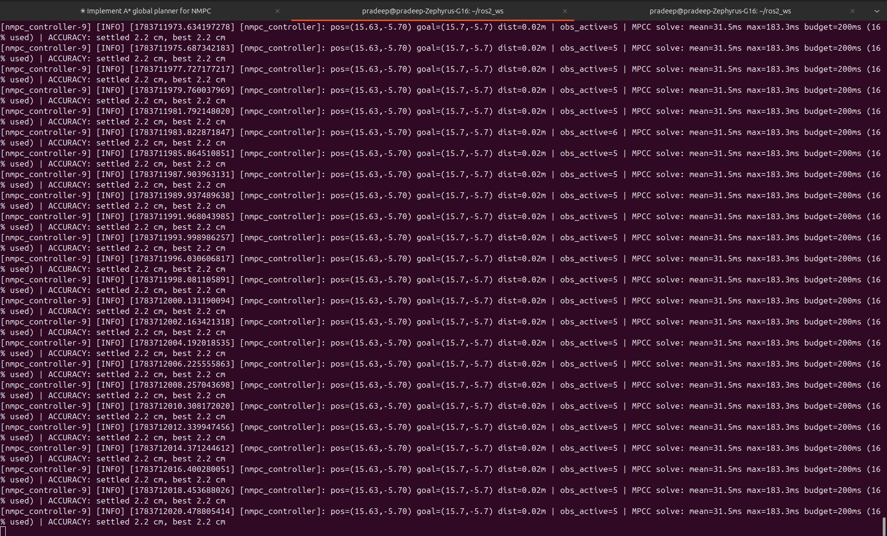

# Custom NMPC for Autonomous Navigation of a Differential-Drive Robot

Goal-directed autonomous navigation for a differential-drive mobile robot in a
cluttered obstacle field — built around a **custom Nonlinear Model Predictive
Controller (NMPC / MPCC)** rather than an off-the-shelf navigation stack. The
robot is given a single goal pose and figures out the rest: it maps the
environment online, plans a global path, and tracks it while reactively
avoiding obstacles, reaching arbitrary goals to **~2–3 cm**.



> **Stack:** ROS 2 Jazzy · Gazebo Harmonic · Python · CasADi/IPOPT · slam_toolbox
> **Course:** ME 5659 — Optimal Control, Northeastern University

---

## Demo

_A one-minute screen recording of a full navigation run — online mapping,
planning through the obstacle field, and precise final parking._

<!-- Add the inline video here (one time, after pushing): open this README on
     GitHub, click the pencil (Edit) icon, place the cursor on the blank line
     below, and drag docs/results/simulation.mp4 into the editor. GitHub uploads
     it and inserts an inline <video> player. Then commit the change. -->


## Overview

A single goal pose is the only input — there are no pre-recorded waypoints. The
system builds an occupancy map from a 2D LiDAR, plans a path with A\*, fuses
wheel odometry with the SLAM pose in an EKF, and follows the path with an NMPC
that also enforces obstacle-avoidance constraints in real time. A dedicated
terminal controller handles precise final parking.

**Pipeline:** `LiDAR → SLAM → A* global path → EKF pose → NMPC/MPCC → goal`

## Key Features

- **Custom NMPC / MPCC controller** (CasADi + IPOPT) — receding-horizon optimal
  control with input and obstacle constraints; a Model Predictive Contouring
  Control (MPCC) mode tracks the global path as a contour for smooth motion.
- **A\* global planner** on the live occupancy grid — Euclidean-distance-transform
  inflation, 8-connected search with corner-cut prevention, and string-pulling
  for short, direct paths. Path hysteresis prevents route flip-flopping.
- **EKF state estimation** — fuses wheel odometry (prediction) with the gated
  SLAM `map → base_link` pose (correction) for drift-free, map-frame control.
- **Reactive obstacle avoidance** — 2D LiDAR clustering + EMA tracking feeds
  soft-constrained obstacle terms directly into the NMPC.
- **Reverse-capable terminal controller** — an Astolfi-style pose stabilizer for
  the final approach, so the robot parks precisely on goals from any direction.
- **Online SLAM** (slam_toolbox) — the map is built live; nothing is pre-mapped.

## System Architecture



| Node | Function | Publishes |
|------|----------|-----------|
| `slam_toolbox` | Online 2D SLAM from `/scan` | `/map`, `map → odom` TF |
| `obstacle_detector` | LiDAR clustering + tracking | `/obstacles` |
| `global_planner` | A\* on the inflated map | `/global_path` |
| `nmpc_controller` | EKF + NMPC/MPCC + terminal controller | `/cmd_vel` |

## Results

Tested in a 30 × 20 m walled arena with ten cylindrical obstacles. The robot
autonomously reaches arbitrary interactive goals from any approach angle
(ahead, beside, or behind — reverse-parking when needed) and refuses goals that
sit inside an obstacle's safety margin.

| Metric | Result |
|--------|--------|
| Final-pose accuracy | **~2–3 cm** (2.2 cm in the run shown) |
| Path following | Threads between cylinders on the shortest route |
| MPCC solve time | ~31 ms mean (200 ms budget) |
| Obstacle safety | Maintains a 0.5 m clearance from obstacle surfaces |

**Simulation world (Gazebo Harmonic)** — the walled arena with ten cylindrical
obstacles and the goal marker (green).


**Live SLAM map, global path, and MPCC tracking (RViz)** — the red trace is the
robot's actual path threading the field to the goal (green).


**Measured accuracy** — the controller logs the true final-pose error; here it
settles 2.2 cm from the goal while the MPCC solves in ~31 ms (200 ms budget).


## Repository Structure

```
nmpc-diffdrive-navigation/        # repo root (ROS 2 package: nmpc_robot_nav)
├── nmpc_robot_nav/
│   ├── nmpc_controller.py     # EKF + NMPC/MPCC + terminal controller
│   ├── global_planner.py      # A* global planner with path hysteresis
│   └── obstacle_detector.py   # LiDAR clustering + tracking
├── config/
│   ├── nmpc_params.yaml        # controller / planner / detector parameters
│   ├── slam_params.yaml        # slam_toolbox configuration
│   └── ros_gz_bridge.yaml      # Gazebo <-> ROS 2 topic bridge
├── launch/sim_nmpc.launch.py   # brings up sim + full stack + RViz
├── worlds/obstacle_course.world
├── urdf/diff_robot_lidar.urdf.xacro
├── rviz/nmpc_view.rviz
└── docs/results/               # figures used in this README
```

## Getting Started

### Prerequisites

- Ubuntu 24.04, **ROS 2 Jazzy**, **Gazebo Harmonic** (gz-sim 8)
- Python: `casadi`, `scipy`, `numpy`
- ROS packages: `slam_toolbox`, `ros_gz_bridge`, `ros_gz_sim`,
  `robot_state_publisher`, `joint_state_publisher`, `xacro`

### Build

```bash
mkdir -p ~/ros2_ws/src && cd ~/ros2_ws/src
git clone https://github.com/aiyanar-p/nmpc-diffdrive-navigation.git
cd ~/ros2_ws
rosdep install --from-paths src --ignore-src -r -y
pip install casadi scipy
colcon build --packages-select nmpc_robot_nav
source install/setup.bash
```

### Run

```bash
ros2 launch nmpc_robot_nav sim_nmpc.launch.py
```

This starts Gazebo, the robot, SLAM, the planner, the controller, and RViz.
Send a goal with the **2D Goal Pose** tool in the RViz toolbar (click and drag
on the map). The robot plans, navigates, and stops on the goal, logging the
final-pose error in centimetres.

> Developed and tested with CycloneDDS. If you hit RMW issues, run
> `export RMW_IMPLEMENTATION=rmw_cyclonedds_cpp` before launching.

## Method

**NMPC / MPCC.** The controller solves a receding-horizon optimal control
problem each cycle over the unicycle model, minimising tracking error and
control effort subject to velocity limits and soft obstacle-avoidance
constraints. In MPCC mode the global path is fit as an arc-length parametric
curve and the cost penalises contour and lag error while rewarding progress,
giving smooth, fast path following. Solved with IPOPT via CasADi, warm-started
each step.

**A\* global planner.** Runs on the inflated occupancy grid. A
distance-transform inflation layer keeps the path where the robot can actually
fit; string-pulling (line-of-sight shortcutting) removes the 8-connected
staircase. Path hysteresis commits to the current route and only re-plans when
the goal changes, the path is blocked, or a meaningfully shorter route appears —
which keeps the controller's reference stable.

**EKF state estimation.** A standard EKF over `[x, y, θ]`: the prediction step
propagates the nonlinear unicycle model (linearised via its Jacobian) using
measured wheel-odometry velocity; the update step fuses the SLAM pose with
outlier gating, so scan-match jumps and drift cannot destabilise control.

**Terminal controller.** For the final ~0.5 m the controller hands off to a
reverse-capable go-to-point law that drives forward or backs up — whichever
needs less turning — so a forward-limited robot still parks precisely on goals
approached from any angle.

## Configuration

All parameters live in `config/nmpc_params.yaml` (commented). Notable ones:

| Parameter | Meaning |
|-----------|---------|
| `use_mpcc` | MPCC contour tracking vs. carrot NMPC fallback |
| `goal_tol` | success radius (final-pose tolerance) |
| `safety_margin` | clearance kept from obstacle surfaces |
| `use_terminal_ctrl` | enable the reverse-capable terminal controller |
| `fuse_slam_pose` | fuse SLAM pose into the EKF (drift correction) |
| `inflation_margin` | A\* obstacle inflation beyond the robot footprint |

## References

1. Rawlings, Mayne, Diehl, *Model Predictive Control: Theory, Computation, and Design*, 2nd ed., 2017.
2. Lam, Manzie, Good, "Model Predictive Contouring Control," *IEEE CDC*, 2010.
3. Liniger, Domahidi, Morari, "Optimization-based autonomous racing of 1:43 scale RC cars," *Optimal Control Applications and Methods*, 2015.
4. Brito et al., "Model Predictive Contouring Control for Collision Avoidance in Unstructured Dynamic Environments," *IEEE RA-L*, 2019 (arXiv:2010.10190).
5. Hart, Nilsson, Raphael, "A Formal Basis for the Heuristic Determination of Minimum Cost Paths," *IEEE Trans. SSC*, 1968.
6. Aicardi, Casalino, Bicchi, Balestrino, "Closed loop steering of unicycle-like vehicles via Lyapunov techniques," *IEEE Robotics & Automation Magazine*, 1995.
7. Siegwart, Nourbakhsh, Scaramuzza, *Introduction to Autonomous Mobile Robots*, 2nd ed., 2011.
8. Thrun, Burgard, Fox, *Probabilistic Robotics*, 2005.
9. Andersson et al., "CasADi: a software framework for nonlinear optimization and optimal control," *Mathematical Programming Computation*, 2019.
10. Wächter, Biegler, "On the implementation of an interior-point filter line-search algorithm (IPOPT)," *Mathematical Programming*, 2006.
11. Macenski, Jambrecic, "SLAM Toolbox: SLAM for the dynamic world," *Journal of Open Source Software*, 2021.

## Author

**Pradeep Sivaa Aiyanar** — ME 5659 (Optimal Control), Northeastern University.

## License

Released under the [MIT License](LICENSE).
